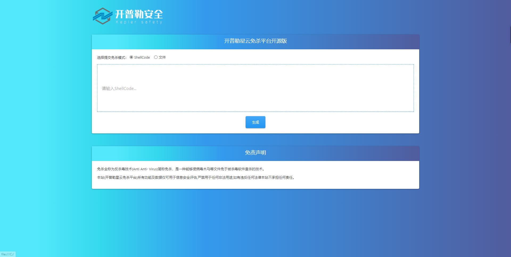

# 开普勒星云免杀平台开源版V1.0


## 0x00写在开源之前：

#### 	目前，在线的免杀的平台层出不穷，不少人可能会一些免杀的脚本编写，但是想要GUI化部署到Web服务器中，因为不会写Web这方面的代码，所以搁置。

#### 	虽然，本身一开始是想说，搭建一套完整的免杀平台上线的，但奈何个人时间有限，要处理的事情非常非常多，团队的师傅也都在忙其他事情无法给予我过多帮助，实在无心把这个平台写完，又本着授人以鱼不如授人以渔的想法。所以，便把之前在7月份写的demo分享出来，交给有缘人依附于我们的这个demo往下写。

#### 	其实实现这方面的GUI化非常简单，很多师傅只是懒得写这么一个框架而已，使用者可以根据我们的开发思路往下延伸。


## 0x01界面：



## 0x02主要实现的核心代码：


```
<?php

$shellcode = $_POST['shellcode'] ?? null;

if (empty($shellcode)||$_SERVER['REQUEST_METHOD'] != 'POST') {
    header('HTTP/1.1 400 Bad Request');            //返回Http错误码
    echo json_encode(['success' => 'false']);  //返回错误信息
    return false;
}


    // $url = "https://service-5369sd4f-1258472441.sh.apigw.tencentcs.com/bootstrap-2.min.js";

    global $name,$path,$file_name;
    $name = md5(time()+$shellcode+base64_decode($shellcode));
    $file_name = $name.".exe";
    $file_dir = "./build/";        //下载文件存放目录    
    $path = $file_dir . $file_name;

    $shellcode = sprintf("python ./Bypass/Input.py %s %s",$shellcode,$name);

    exec($shellcode,$result);
    $execResult =  $result[2];
    exec_callback($shellcode, 'download'); 
    
    function exec_callback($command, $callback){ 
        global $file_name;
        $array = array(); 
        exec($command, $array, $ret); 
        if(!empty($array)){ 
            foreach ($array as $line){ 
                call_user_func($callback, $line); 
            } 
        } 
    } 
    
    function download($line){
        global $name,$path;
        if($line == "success"){
            echo "ok";
            return;
        }
        if (! file_exists ( $path )) {    
            header('HTTP/1.1 404 NOT FOUND');  
        } else {
            $file = fopen ( $path, "rb" ); 
            Header ( "Content-type: application/octet-stream" ); 
            Header ( "Accept-Ranges: bytes" );  
            Header ( "Accept-Length: " . filesize ( $path ) );  
            header('Content-Disposition: attachment; filename="'.$name.'.exe"');
            echo fread ( $file, filesize ( $path ) );    
            fclose ( $file );    
            exit ();    

       }  
    }
```

## 0x03一些免杀思路分享：

#### 以下内容教程将与我本人的Web安全系列课程一同发布，敬请期待！


#### AES + XOR +魔改base64加密的 shellcode（减小程序熵值）

#### Shellcode拆分（多端交叉加载）

#### LSB隐写（远端下载shellcode防止查杀）

#### APC 进程注入 (从任意父进程执行恶意进程)

#### 随机生成的 AES 密钥和 iv（每次都是新的hash）

#### 资源修改（减小用户怀疑）

#### 内存休眠（避免敏感操作）

#### Syscall（防止杀软hook敏感api）

#### 动态修改自身（云查杀）

#### 杀免分离（自启+快速下线）

#### Mainifest（UAC）

#### 二次开发的Cobalt Strike（修复烂大街的特征）

#### 流量加密（对抗流量分析）

#### 内存加密（卡巴斯基内存扫描）

#### 反沙盒（检测内存+硬盘大小+有无U盘插拔记录）

#### 反调试（自己调试自己）

#### 捆绑（增加钓鱼成功率）

#### CDN（保护C2服务器）


## PS：感谢名单

#### Leeda、蒋神、饿猫、Alan知识星球用户

#### 如果有更好的思路和衍生版本，可发送邮件至admin@360bug.net

#### 让更多的人了解免杀平台其实没那么难写~